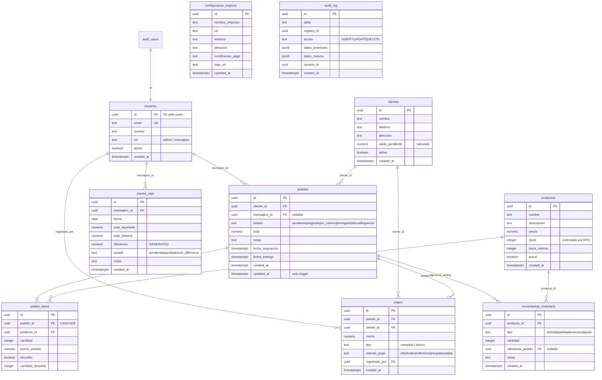

# Base de Datos - Imperial Apps

> Referencia de estructura, relaciones y reglas de la base de datos en produccion.
> Actualizar este documento cada vez que se modifique el esquema.

---

## Diagrama de Relaciones (ERD)



---

## Diccionario de Datos

### usuarios
| Campo | Tipo | Nullable | Default | Notas |
|-------|------|----------|---------|-------|
| id | UUID | NO | — | PK, FK a auth.users (CASCADE) |
| email | TEXT | NO | — | UNIQUE |
| nombre | TEXT | NO | — | |
| rol | TEXT | NO | — | CHECK: admin, mensajero |
| activo | BOOLEAN | NO | true | Soft delete |
| created_at | TIMESTAMPTZ | NO | now() | |

### clientes
| Campo | Tipo | Nullable | Default | Notas |
|-------|------|----------|---------|-------|
| id | UUID | NO | gen_random_uuid() | PK |
| nombre | TEXT | NO | — | |
| telefono | TEXT | SI | — | |
| direccion | TEXT | SI | — | |
| saldo_pendiente | NUMERIC(12,2) | NO | 0 | Calculado por RPC `actualizar_saldo_cliente` |
| activo | BOOLEAN | NO | true | Soft delete |
| created_at | TIMESTAMPTZ | NO | now() | |

### productos
| Campo | Tipo | Nullable | Default | Notas |
|-------|------|----------|---------|-------|
| id | UUID | NO | gen_random_uuid() | PK |
| nombre | TEXT | NO | — | |
| descripcion | TEXT | SI | — | |
| precio | NUMERIC(12,2) | NO | — | |
| stock | INTEGER | NO | 0 | Solo modificar via RPC `descontar_stock` / `reingresar_stock` |
| stock_minimo | INTEGER | NO | 5 | Para alertas |
| activo | BOOLEAN | NO | true | Soft delete |
| created_at | TIMESTAMPTZ | NO | now() | |

### pedidos
| Campo | Tipo | Nullable | Default | Notas |
|-------|------|----------|---------|-------|
| id | UUID | NO | gen_random_uuid() | PK |
| cliente_id | UUID | NO | — | FK clientes |
| mensajero_id | UUID | SI | — | FK usuarios, null si no asignado |
| estado | TEXT | NO | 'pendiente' | CHECK: pendiente, asignado, en_camino, entregado, devuelto, parcial |
| total | NUMERIC(12,2) | NO | 0 | Suma de items |
| notas | TEXT | SI | — | |
| fecha_asignacion | TIMESTAMPTZ | SI | — | Se llena al asignar mensajero |
| fecha_entrega | TIMESTAMPTZ | SI | — | Se llena al confirmar entrega |
| created_at | TIMESTAMPTZ | NO | now() | |
| updated_at | TIMESTAMPTZ | NO | now() | Auto-trigger |

### pedido_items
| Campo | Tipo | Nullable | Default | Notas |
|-------|------|----------|---------|-------|
| id | UUID | NO | gen_random_uuid() | PK |
| pedido_id | UUID | NO | — | FK pedidos (CASCADE) |
| producto_id | UUID | NO | — | FK productos |
| cantidad | INTEGER | NO | — | |
| precio_unitario | NUMERIC(12,2) | NO | — | Snapshot del precio al momento |
| devuelto | BOOLEAN | NO | false | |
| cantidad_devuelta | INTEGER | NO | 0 | Parcial o total |

### pagos
| Campo | Tipo | Nullable | Default | Notas |
|-------|------|----------|---------|-------|
| id | UUID | NO | gen_random_uuid() | PK |
| pedido_id | UUID | NO | — | FK pedidos |
| cliente_id | UUID | NO | — | FK clientes |
| monto | NUMERIC(12,2) | NO | — | |
| tipo | TEXT | NO | — | CHECK: completo, abono |
| metodo_pago | TEXT | NO | 'efectivo' | CHECK: efectivo, transferencia, nequi, daviplata |
| registrado_por | UUID | NO | — | FK usuarios (quien registro el pago) |
| created_at | TIMESTAMPTZ | NO | now() | |

### movimientos_inventario
| Campo | Tipo | Nullable | Default | Notas |
|-------|------|----------|---------|-------|
| id | UUID | NO | gen_random_uuid() | PK |
| producto_id | UUID | NO | — | FK productos |
| tipo | TEXT | NO | — | CHECK: entrada, salida, devolucion, ajuste |
| cantidad | INTEGER | NO | — | |
| referencia_pedido | UUID | SI | — | FK pedidos |
| notas | TEXT | SI | — | |
| created_at | TIMESTAMPTZ | NO | now() | |

### cierres_caja
| Campo | Tipo | Nullable | Default | Notas |
|-------|------|----------|---------|-------|
| id | UUID | NO | gen_random_uuid() | PK |
| mensajero_id | UUID | NO | — | FK usuarios |
| fecha | DATE | NO | — | |
| total_reportado | NUMERIC(12,2) | NO | — | Lo que dice el mensajero |
| total_sistema | NUMERIC(12,2) | NO | — | Lo que registra el sistema |
| diferencia | NUMERIC(12,2) | — | GENERATED | total_reportado - total_sistema |
| estado | TEXT | NO | 'pendiente' | CHECK: pendiente, aprobado, con_diferencia |
| notas | TEXT | SI | — | |
| created_at | TIMESTAMPTZ | NO | now() | |

### configuracion_negocio
| Campo | Tipo | Nullable | Default | Notas |
|-------|------|----------|---------|-------|
| id | UUID | NO | gen_random_uuid() | PK |
| nombre_empresa | TEXT | NO | — | |
| nit | TEXT | SI | — | |
| telefono | TEXT | SI | — | |
| direccion | TEXT | SI | — | |
| condiciones_pago | TEXT | SI | — | Se muestra en PDFs |
| logo_url | TEXT | SI | — | |
| updated_at | TIMESTAMPTZ | NO | now() | |

### audit_log
| Campo | Tipo | Nullable | Default | Notas |
|-------|------|----------|---------|-------|
| id | UUID | NO | gen_random_uuid() | PK |
| tabla | TEXT | NO | — | Nombre de la tabla afectada |
| registro_id | UUID | NO | — | ID del registro afectado |
| accion | TEXT | NO | — | CHECK: INSERT, UPDATE, DELETE |
| datos_anteriores | JSONB | SI | — | Estado antes del cambio |
| datos_nuevos | JSONB | SI | — | Estado despues del cambio |
| usuario_id | UUID | SI | — | auth.uid() al momento |
| created_at | TIMESTAMPTZ | NO | now() | |

---

## Funciones RPC

| Funcion | Parametros | Retorna | Uso |
|---------|-----------|---------|-----|
| `descontar_stock` | producto_id, cantidad, referencia_pedido? | BOOLEAN | Descuenta stock con `FOR UPDATE` (evita race conditions). Retorna false si no hay stock suficiente. Registra movimiento automaticamente. |
| `reingresar_stock` | producto_id, cantidad, referencia_pedido? | VOID | Reingresa stock por devolucion. Registra movimiento automaticamente. |
| `actualizar_saldo_cliente` | cliente_id | VOID | Recalcula saldo_pendiente del cliente (total pedidos - total pagos). |
| `obtener_rol_usuario` | — | TEXT | Helper interno para RLS. Retorna el rol del usuario autenticado. |

---

## Triggers

| Trigger | Tabla | Evento | Funcion | Proposito |
|---------|-------|--------|---------|-----------|
| trigger_pedidos_updated_at | pedidos | BEFORE UPDATE | actualizar_updated_at | Auto-actualiza `updated_at` |
| audit_pagos | pagos | AFTER INSERT/UPDATE/DELETE | registrar_auditoria | Auditoría financiera |
| audit_pedidos | pedidos | AFTER INSERT/UPDATE/DELETE | registrar_auditoria | Auditoría de pedidos |
| audit_movimientos | movimientos_inventario | AFTER INSERT/UPDATE/DELETE | registrar_auditoria | Auditoría de stock |
| audit_productos | productos | AFTER UPDATE | registrar_auditoria | Auditoría de cambios en productos |

---

## Indices

| Indice | Tabla | Campo(s) | Proposito |
|--------|-------|----------|-----------|
| idx_pedidos_cliente | pedidos | cliente_id | Buscar pedidos por cliente |
| idx_pedidos_mensajero | pedidos | mensajero_id | Buscar pedidos por mensajero |
| idx_pedidos_estado | pedidos | estado | Filtrar por estado |
| idx_pedidos_created | pedidos | created_at | Ordenar por fecha |
| idx_pagos_cliente | pagos | cliente_id | Historial de pagos por cliente |
| idx_pagos_pedido | pagos | pedido_id | Pagos de un pedido |
| idx_movimientos_producto | movimientos_inventario | producto_id | Historial de movimientos |
| idx_pedido_items_pedido | pedido_items | pedido_id | Items de un pedido |
| idx_cierres_mensajero | cierres_caja | mensajero_id | Cierres por mensajero |
| idx_cierres_fecha | cierres_caja | fecha | Cierres por fecha |
| idx_audit_tabla | audit_log | tabla, registro_id | Buscar auditoría por registro |
| idx_audit_created | audit_log | created_at | Ordenar auditoría por fecha |
| idx_usuarios_rol | usuarios | rol | Filtrar por rol |
| idx_clientes_activo | clientes | activo | Filtrar activos |
| idx_productos_activo | productos | activo | Filtrar activos |

---

## Row Level Security (RLS)

Todas las tablas tienen RLS habilitado.

| Tabla | Admin | Mensajero |
|-------|-------|-----------|
| usuarios | Full access | Solo ve su propio registro |
| clientes | Full access | Solo lectura |
| productos | Full access | Solo lectura |
| pedidos | Full access | Ve/actualiza solo los asignados a el |
| pedido_items | Full access | Ve solo los de sus pedidos |
| pagos | Full access | Inserta con su ID, ve solo los que registro |
| movimientos_inventario | Full access | Solo lectura |
| cierres_caja | Full access | Ve/inserta solo los propios |
| configuracion_negocio | Full access | Solo lectura |
| audit_log | Solo lectura | Sin acceso |

---

## Flujo de Stock

```
Crear pedido (pendiente)     → Stock NO se toca
Asignar mensajero (asignado) → Stock SE DESCUENTA (via descontar_stock RPC)
Entrega confirmada           → Sin cambio de stock
Devolucion                   → Stock SE REINGRESA (via reingresar_stock RPC)
```

**Regla critica**: NUNCA modificar `productos.stock` directamente con UPDATE. Siempre usar las funciones RPC que incluyen `FOR UPDATE` para evitar race conditions.

---

## Flujo de Saldo Cliente

```
Se crea pedido       → saldo_pendiente aumenta
Se registra pago     → saldo_pendiente disminuye
Pedido devuelto      → saldo_pendiente se recalcula
```

Recalculo via `actualizar_saldo_cliente(cliente_id)`:
`saldo = SUM(pedidos.total donde estado != 'devuelto') - SUM(pagos.monto)`
